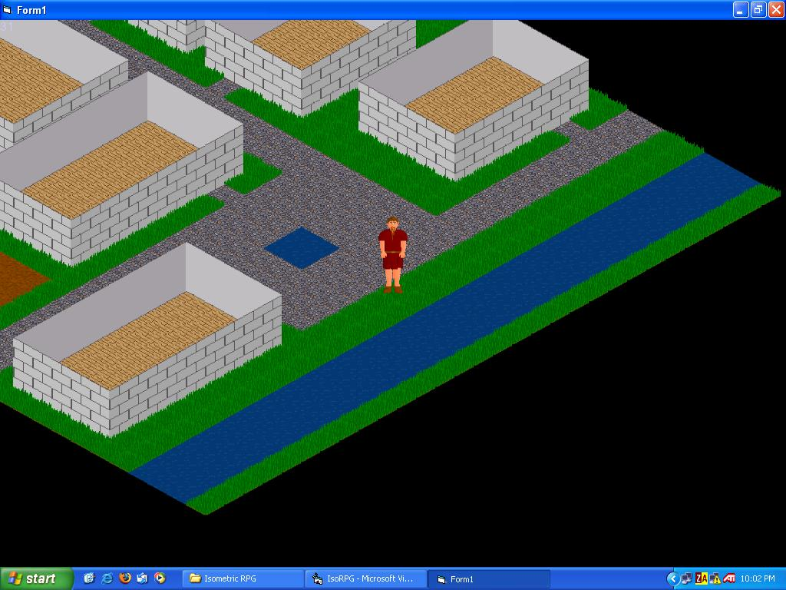

## \[\*DirectX 8 Isometric RPG \- UPDATED\!\*\]

### Description

A simple isometric RPG engine that can read maps from a save file, draw the map, draw the player, read walls from a save file, draw an NPC, draw the walls, and can move the character. UPDATE: I got character movement working! As long as the players movement is less than 17 pixels it works fine. Also added NPCs, but they are far from being done. The code is kinda messy, but I will clean it up when I'm done.
 
### More Info
 

             |
---                |---
**Submitted On**   |2004-12-06 22:00:28
**By**             |[Calvin Mayer](https://github.com/Planet-Source-Code/PSCIndex/blob/master/ByAuthor/calvin-mayer.md)
**Level**          |Advanced
**User Rating**    |4.8 (29 globes from 6 users)
**Compatibility**  |VB 6\.0
**Category**       |[DirectX](https://github.com/Planet-Source-Code/PSCIndex/blob/master/ByCategory/directx__1-44.md)
**World**          |[Visual Basic](https://github.com/Planet-Source-Code/PSCIndex/blob/master/ByWorld/visual-basic.md)
**Archive File**   |[\[\_DirectX\_1826431262004\.zip](https://github.com/Planet-Source-Code/calvin-mayer-directx-8-isometric-rpg-updated__1-57325/archive/master.zip)

